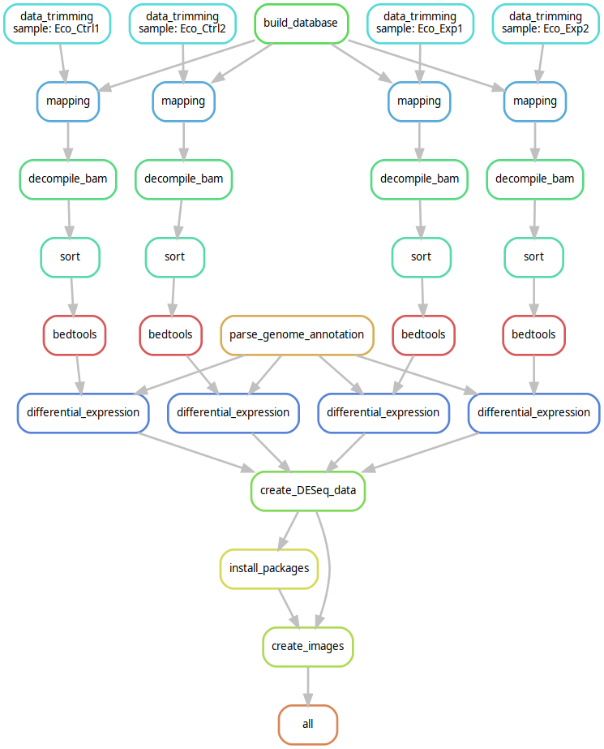
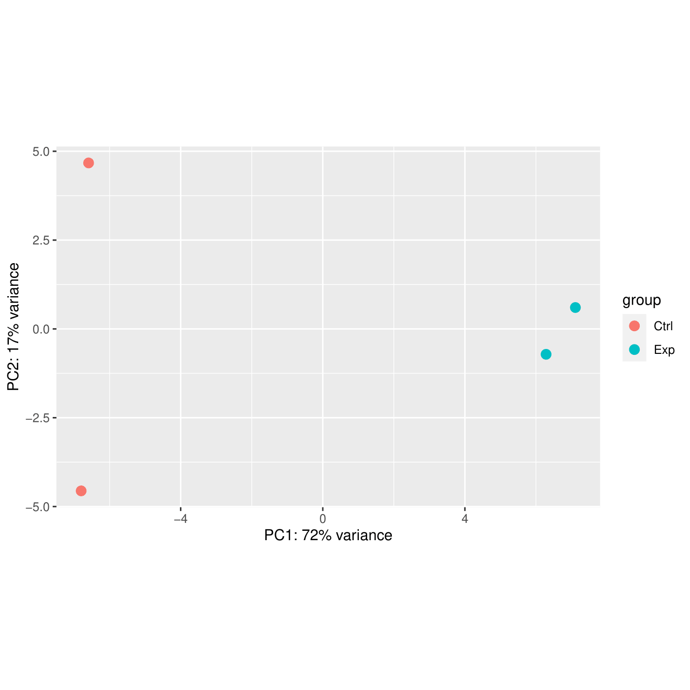
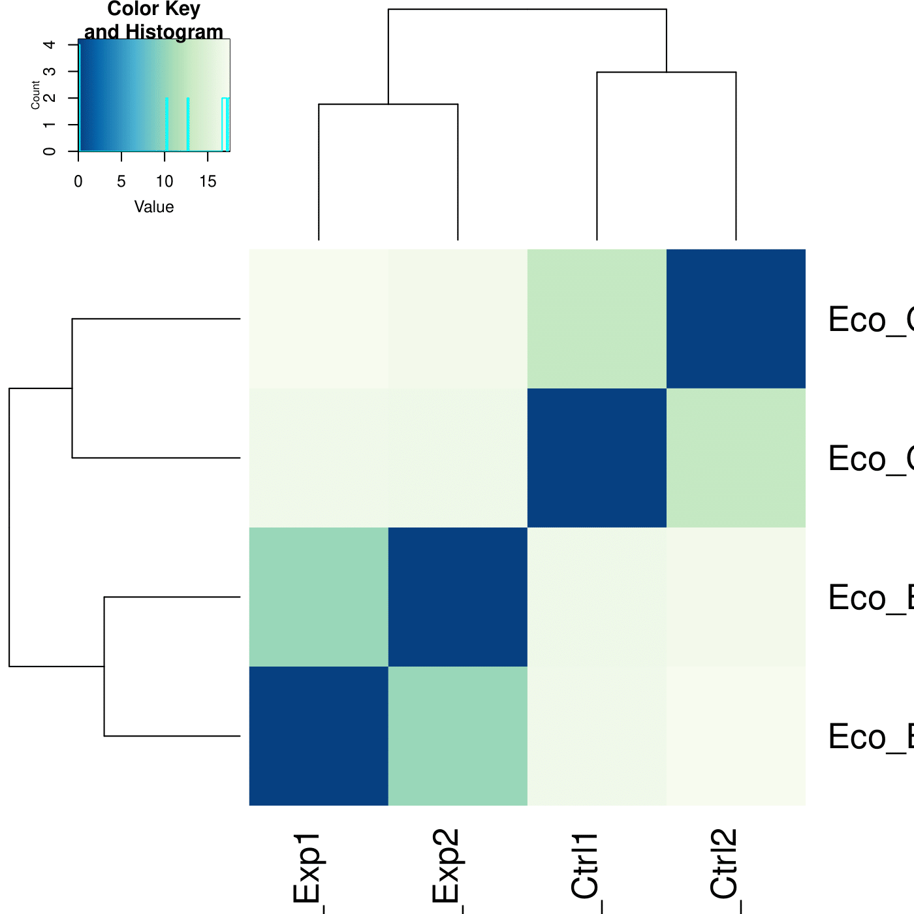

# STATR pipeline snakemake

This repository contains a snakemake variant of the STATR pipeline. STATR is a pipeline created for raw RiboSeq fastq data to be converted into a format to be used in expression studies. The data first gets trimmed with trimmomatic, removing low quality reads. Up next the data gets mapped using bowtie2 after which it gets decompiled with samtools and bedtools. Next up the data gets visualized through the R package DESeq2. The final visualized data consist of a PCA plot, heatmap and dendrogram which can be used to control the quality of the data by looking at the variance in the data. Furhtermore, the coverage files and DESeq dataset can be further used in expression studies. \

The original pipeline was created in bash. In this version the user would have to specify all samples in every step in the bash files. Snakemake creates a easier to use pipeline with it's config file being the only file to be edited by the user. Because of this the goal of the project was to convert this original bash pipeline into a snakemake variant.

The original study and pipeline can be found at the following locations:

[Article](https://www.ncbi.nlm.nih.gov/pmc/articles/PMC7209825/) \
[Original pipeline](https://github.com/robinald/STATR)

## Installation

The pipeline is created in snakemake, python and R. Further, it uses trimmomatic, bowtie2, samtool and bedtools for data processing. The required R packages are installed by the pipeline.

Versions used: \
Snakemake 7.18 was used for this pipeline, it can be installed with the command: \
`pip3 install snakemake` \
or for conda install: \
`conda install -c bioconda snakemake` \
For further install visit the snakemake [website](https://snakemake.readthedocs.io/en/stable/getting_started/installation.html) \
Python 3.11\
`sudo apt-get install python=3.11` \
Or visit [documentation](https://www.python.org/downloads/) \
R 4.0.2 \
`sudo apt-get install r-base=4.0.2` \
Or visit [documentation](https://cran.r-project.org/bin/linux/ubuntu/fullREADME.html) \
Trimmomatic 0.39 \
`sudo apt-get install trimmomatic=0.39` \
Or visit [documentation](https://ubuntu.pkgs.org/20.04/ubuntu-universe-amd64/trimmomatic_0.39+dfsg-1_all.deb.html) \
Bowtie2 2.3.4 \
`sudo apt-get install Bowtie2=2.3.4` \
Or visit [documentation](https://www.metagenomics.wiki/tools/bowtie2/install) \
Samtools 1.15 \
`sudo apt-get samtools=1.15` \
Or visit [documentation](https://www.biostars.org/p/328831/) \
BEDtools 2.27 \
`sudo apt-get bedtools=2.27` \
Or visit [documentation](https://bedtools.readthedocs.io/en/latest/content/installation.html)
\

All files needed are provided in the pipeline as the example versions as provided by the original pipeline. Required files are the input fastq.gz files, a design sheet file matching the input, a reference fasta file, a reference genome annotation file and a riboseq adapter file for the trimmomatic tool. 

## Pipeline overview

Figure 1 shows a visualization of the STATR pipeline. The pipeline is build up from 5 smk files, each with rules for specific tasks.\
\
trimmomatic.smk: \
data_trimming: Uses the trimmmomatic tool to trim the raw data by removing low quality reads and adapter sequences. \
\
mapping.smk: \
build_database: Builds a reference database from the reference genome file with bowtie2 to be used in the mapping done by bowtie2. \
mapping: Performs read mapping using bowtie2 and the reference database to turn the trimmed data files into .sam files. \
\
decompiling.smk: \
decompiling_bam: Uses samtools to turn the .sam files into .bam files. \
sort: Sorts bam files. \
bedtools: Turns bam files into bed files with bedtools. \
\
expression.smk: \
parse_genome_annotation: Uses python script to parse the genome annotation file into one to be used by bedtools. \
differential_expression: Uses bedtools and the new genome annotation file to create expression data files. \
create_DESeq_data: Uses a python script to turn the expression data into a format to be used in the DESeq2 tool in R. \
\
visualize.smk: \
install_packages: Installs required R packages for DESeq2 use. \
create_images: Uses a R script to create a PCA, heatmap and dendrogram from the data.

## Run pipeline
To run the pipeline clone the repository and use the following command: \
\
snakemake --snakefile workflow/Snakefile --cores n \
\
With n being the amount of cores used. The amount of threads used and the location of input files and directory's can be changed in the config.yaml file found in the config folder. \
\

## Visualization
Figures 2 and 3 show the created PCA plot, heatmap and dendrogram.

The heatmap shows variance spread within the data with the dendrogram and heatmap showing variance between the samples themself. RNA expression data as used in STATR often has problems with biological variance in the data which alters the expression values. High biological variance can make the expression data unreliable as changes in expression could be through this variance and not because of genetic effects. Because of this the pca, heatmap and dendrogram can be used to determine the quality of the outputted data and to consider if it is usable for further studies.
